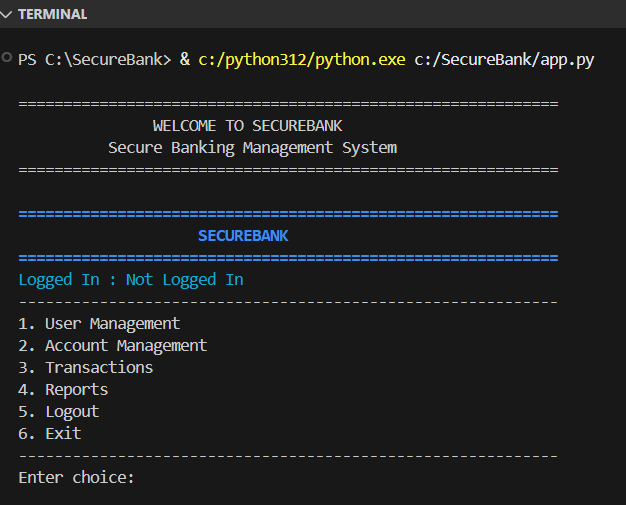
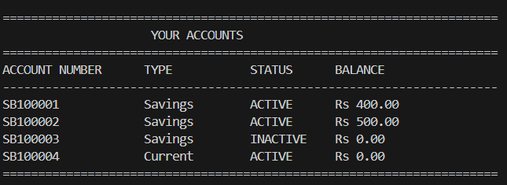
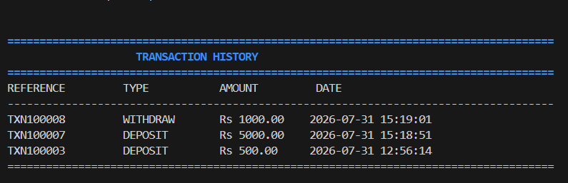
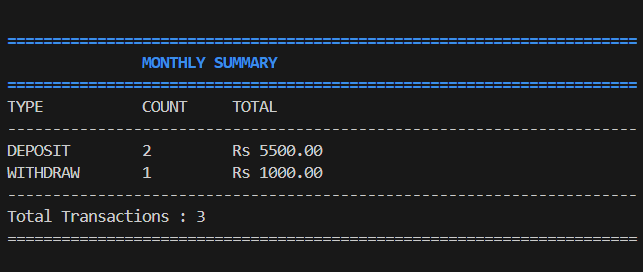
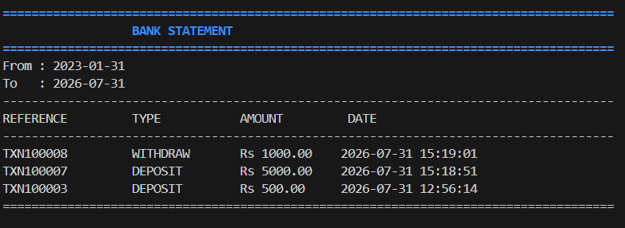
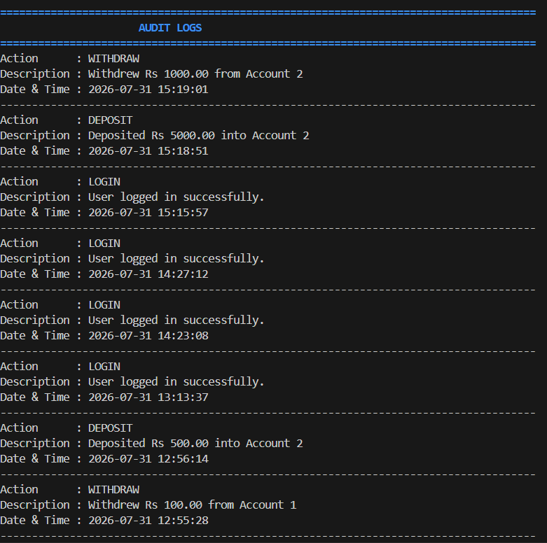
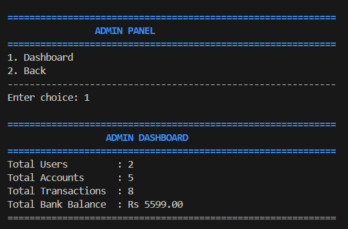
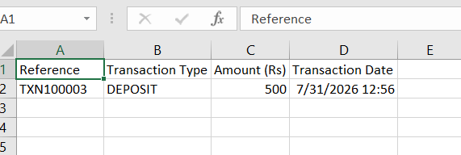
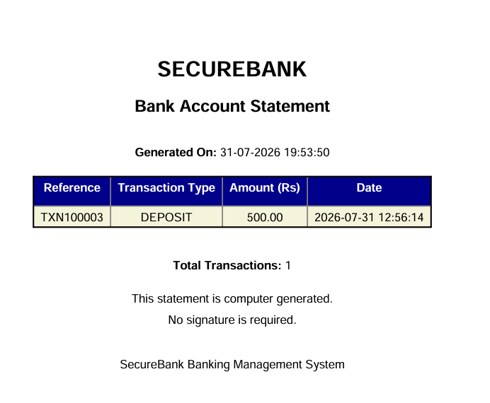

# SecureBank - Banking Management System

A secure, modular, and console-based Banking Management System built using Python and SQLite. The application allows users to securely manage bank accounts, perform banking transactions, generate reports, and maintain audit logs through a clean, service-oriented architecture.

---

## Features

### User Management

- User Registration
- Secure Login with bcrypt Password Hashing
- Change Password
- Logout

### Account Management

- Create Savings and Current Accounts
- View All Accounts
- View Active Accounts
- Activate or Deactivate Accounts
- View Account Statistics

### Transactions

- Deposit Money
- Withdraw Money
- Transfer Funds Between Accounts
- View Transaction History
- Monthly Transaction Summary
- Search Transactions by Type
- Generate Bank Statement Between Date Range

### Reports

- Export Transaction History to CSV
- Export Transaction History to PDF
- View Audit Logs

### Admin Panel

- Dashboard with Overall Banking Statistics
- Total Users
- Total Accounts
- Total Transactions
- Total Bank Balance

---

# Tech Stack

- Python 3.12
- SQLite
- bcrypt
- ReportLab
- Colorama

---

# Project Structure

```
SecureBank/
│
├── app.py
├── requirements.txt
├── README.md
│
├── cli/
│   └── menu.py
│
├── database/
│   └── db.py
│
├── services/
│   ├── account_services.py
│   ├── admin_services.py
│   ├── audit_services.py
│   ├── transaction_services.py
│   └── user_services.py
│
├── utils/
│   ├── csv_export.py
│   ├── pdf_export.py
│   └── display.py
│
├── exports/
│
└── database.db
```

---

# Database Design

The application uses SQLite as the backend database.

### Tables

- Users
- Accounts
- Transactions
- Audit Logs

### Relationships

- One User can own multiple Accounts.
- One Account can have multiple Transactions.
- Every important user activity is recorded in the Audit Logs table.

---

# Installation

## Clone the Repository

```bash
git clone https://github.com/Shubhijain03/SecureBank.git
```

## Navigate to the Project

```bash
cd SecureBank
```

## Install Dependencies

```bash
pip install -r requirements.txt
```

## Run the Application

```bash
python app.py
```

---

# Application Workflow

1. Register a new user account.
2. Login securely.
3. Create one or more bank accounts.
4. Perform deposits, withdrawals, and fund transfers.
5. View account statistics and transaction history.
6. Generate bank statements.
7. Export reports in CSV or PDF format.
8. Review audit logs.
9. Logout securely.

---

# Security Features

- Passwords are securely hashed using bcrypt.
- Parameterized SQL queries prevent SQL Injection.
- Audit logging tracks important user activities.
- Input validation for banking operations.
- Account activation and deactivation support.

---

# Reports Generated

- Transaction History
- Monthly Transaction Summary
- Bank Statement
- CSV Export
- PDF Export
- Audit Logs

---

# Future Enhancements

- Interest Calculation
- Loan Management
- Fixed Deposit Module
- OTP-Based Authentication
- Email Notifications
- Role-Based Access Control
- Graphical User Interface (GUI)
- REST API Integration

---

# Key Learning Outcomes

This project demonstrates practical implementation of:

- Modular Software Architecture
- Object-Oriented Programming
- SQLite Database Design
- CRUD Operations
- Password Hashing with bcrypt
- Exception Handling
- File Handling
- CSV & PDF Report Generation
- Banking Transaction Management
- Audit Logging

---

# Screenshots

Screenshots of the application interface will be added here.

---

# License

# This project is intended for educational purposes and portfolio demonstration.

# SecureBank - Banking Management System

A secure, modular, and console-based Banking Management System built using Python and SQLite. The application allows users to securely manage bank accounts, perform banking transactions, generate reports, and maintain audit logs through a clean, service-oriented architecture.

---

## Features

### User Management

- User Registration
- Secure Login with bcrypt Password Hashing
- Change Password
- Logout

### Account Management

- Create Savings and Current Accounts
- View All Accounts
- View Active Accounts
- Activate or Deactivate Accounts
- View Account Statistics

### Transactions

- Deposit Money
- Withdraw Money
- Transfer Funds Between Accounts
- View Transaction History
- Monthly Transaction Summary
- Search Transactions by Type
- Generate Bank Statement Between Date Range

### Reports

- Export Transaction History to CSV
- Export Transaction History to PDF
- View Audit Logs

### Admin Panel

- Dashboard with Overall Banking Statistics
- Total Users
- Total Accounts
- Total Transactions
- Total Bank Balance

---

# Tech Stack

- Python 3.12
- SQLite
- bcrypt
- ReportLab
- Colorama

---

# Project Structure

```
SecureBank/
│
├── app.py
├── requirements.txt
├── README.md
│
├── cli/
│   └── menu.py
│
├── database/
│   └── db.py
│
├── services/
│   ├── account_services.py
│   ├── admin_services.py
│   ├── audit_services.py
│   ├── transaction_services.py
│   └── user_services.py
│
├── utils/
│   ├── csv_export.py
│   ├── pdf_export.py
│   └── display.py
│
├── exports/
│
└── database.db
```

---

# Database Design

The application uses SQLite as the backend database.

### Tables

- Users
- Accounts
- Transactions
- Audit Logs

### Relationships

- One User can own multiple Accounts.
- One Account can have multiple Transactions.
- Every important user activity is recorded in the Audit Logs table.

---

# Installation

## Clone the Repository

```bash
git clone https://github.com/Shubhijain03/SecureBank.git
```

## Navigate to the Project

```bash
cd SecureBank
```

## Install Dependencies

```bash
pip install -r requirements.txt
```

## Run the Application

```bash
python app.py
```

---

# Application Workflow

1. Register a new user account.
2. Login securely.
3. Create one or more bank accounts.
4. Perform deposits, withdrawals, and fund transfers.
5. View account statistics and transaction history.
6. Generate bank statements.
7. Export reports in CSV or PDF format.
8. Review audit logs.
9. Logout securely.

---

# Security Features

- Passwords are securely hashed using bcrypt.
- Parameterized SQL queries prevent SQL Injection.
- Audit logging tracks important user activities.
- Input validation for banking operations.
- Account activation and deactivation support.

---

# Reports Generated

- Transaction History
- Monthly Transaction Summary
- Bank Statement
- CSV Export
- PDF Export
- Audit Logs

---

# Future Enhancements

- Interest Calculation
- Loan Management
- Fixed Deposit Module
- OTP-Based Authentication
- Email Notifications
- Role-Based Access Control
- Graphical User Interface (GUI)
- REST API Integration

---

# Key Learning Outcomes

This project demonstrates practical implementation of:

- Modular Software Architecture
- Object-Oriented Programming
- SQLite Database Design
- CRUD Operations
- Password Hashing with bcrypt
- Exception Handling
- File Handling
- CSV & PDF Report Generation
- Banking Transaction Management
- Audit Logging

---

# Screenshots

## Application Screenshots

### Main Menu



### Account Management



### Transaction History



### Monthly Summary



### Bank Statement



### Audit Logs



### Admin Dashboard



### CSV Export



### PDF Export



---

# License

This project is intended for educational purposes and portfolio demonstration.
